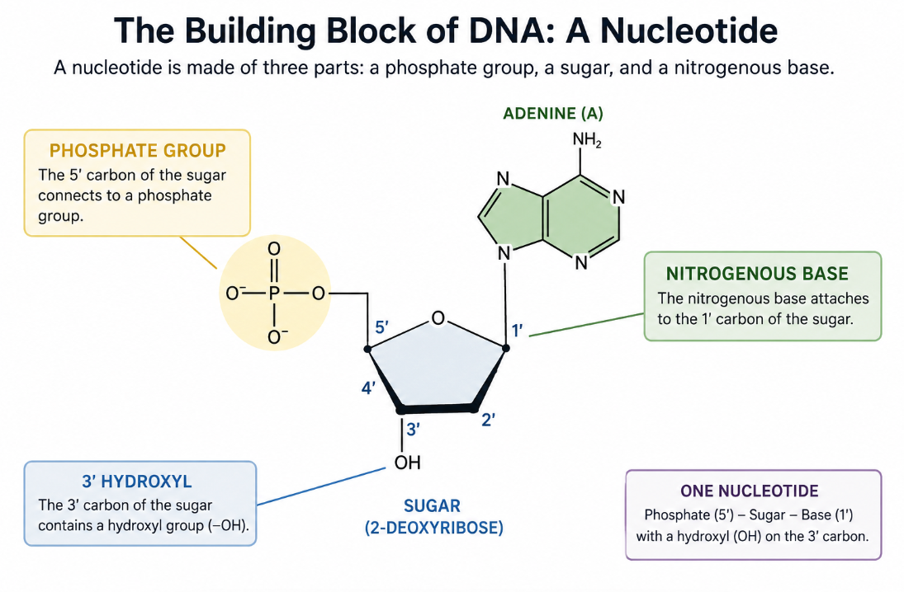

<!--

## DNA

Everyone's heard of DNA, but what is it? How does it work? How does CRISPR work on it? It's a necessary starting point for our overarching discussion.

DNA chemically is a strand of nucleotides, consisting of a phosphate, sugar, and nitrogenous base. If some of those words confuse you, don't worry, it's not super important to know all the chemical details.

If we take one nucleotide containing adenine for example, its sugar is 2-deoxyribose. The carbons of this sugar are numbered 1' (pronounced "1 prime"), 2', 3', 4', 5'.

The nitrogenous base attaches to the 1' carbon of the sugar: base - 1' carbon of sugar

The 3' carbon contains a hydroxyl: 3' - OH

The 5' Carbon connects to a phosphate group. So one nucleotide looks like this:

From there, let's say we have two nucleotides. The 3' oxygen of nucleotide one connects to the 5' phosptage of nucloetide 2, so you get a: sugar - O - P - O - sugar

You can see that the phosphorus atoms is bonded through oxygen atoms to the two sugars, which is why this type of bond is called a /bold{phosphodiester bond}. These same bonds repeat to form a chain of nucleotides. One end has a free 5' phosphate and the other end has a free 3' hydroxyl. This is why we say DNA has a 5' end and a 3' end. For example:

/bold{5′−A−G−C−T−G−A−3′}

This direction matters A LOT. DNA Polymerase syntehsizes bew DNA in the 5' to 3' direction, as do RNA polymerases. CRISPR Guide RNA also has an orientation which is important.

Now an importnat point here: /bold{the DNA Backbone is negatively charged}. This is super important for CRISPR.

-->

## CRISPR

If you've paid any attention to the news, you know that CRISPR is a gene-editing tool. In December 2023, the world got its first CRISPR-based therapy with Casgevy. Last year, researchers used base editing to save an treat an infant with severe CPS1 deficiency (a rare liver disorder that causes ammonia to accumulate in the blood). But what does all this really mean? How does it work?

## CRISPR is the address; Cas9 is the machine

The phrase “CRISPR–Cas9” tends to collapse several jobs into one. CRISPR began as a microbial defense system: pieces of genetic material from previous invaders are stored and later expressed as RNAs that help recognize matching sequences. Cas9 is the protein effector. Give it a guide RNA and it becomes a programmable search complex.

CRISPR stands for Clustered Regularly Interspaced Short Palindromic Repeats. In it's early days before the hype, all that was known was that CRISPR was a bacterial adaptive immune system found in around 40% of bacteria. Experiments showed that the CRISPR system allow bacteria to recognize an infection with a virus and ultimately kill the virus. But it wasn't known how the molecules that participate in this destruction worked. But it was known that these CAS (CRISPR Associated Sequences) Proteins were the ones that did the work. Cas9 is one of those proteins, but at the time it was known as Csn1.

In nature it was seen that CRISPR systems have CrRNA, just little copies of the virus that the bacteria had seen before. And it was also seen that there was a tracrRNA, which is a little RNA that helps the Cas9 protein find the CrRNA.

Martin Jinek a scientist from Doudna Lab and Krzysztof Chylinski from Charpentier lab realized that together, the crRNA and tracrRNA could be fused into a single guide RNA. This was a huge breakthrough because it meant that Cas9 could be programmed to target any DNA sequence by simply changing the guide RNA sequence.

The example here is **Streptococcus pyogenes Cas9**, usually shortened to **SpyCas9**. It is the workhorse most people mean when they say “Cas9”: a 1,368-amino-acid protein whose two lobes wrap around RNA and DNA.

:::tangent

The study that motivated this post models a four-chain ribonucleoprotein: SpyCas9, a 96-nucleotide single-guide RNA (a 20-nt spacer plus a 76-nt scaffold), and the two strands of a 30-nt DNA target. Those lengths describe the structural-screening setup—not every possible experimental guide or target design.

:::

## The protein is a moving checkpoint

SpyCas9 has a broad **recognition lobe (REC)** and a **nuclease lobe (NUC)**. The guide RNA threads between them. This architecture matters because Cas9 is not simply a pair of scissors waiting in an open position; guide binding reshapes the protein into a surveillance complex, and target binding drives more conformational checks before catalysis.

The recognition lobe helps sense the RNA–DNA hybrid. The nuclease lobe contains the catalytic machinery, the bridge helix that helps communicate between lobes, and the PAM-interacting region that grants access to a potential target.

:::research-question

How does SpyCas9 avoid opening every stretch of DNA it passes?

:::

It reads a short motif first. For SpyCas9, the canonical protospacer-adjacent motif is **5′-NGG-3′**: any base followed by two guanines. The PAM is not part of the guide-matching sequence. It sits immediately beside it, acting more like a license to inspect.

Two arginines in the PAM-interacting domain—**R1333 and R1335**—contact those guanines. If either contact is lost, SpyCas9 cannot reliably recognize the PAM and the rest of the targeting sequence never gets a proper audition.

## From PAM to R-loop

Once the PAM is recognized, the nearby DNA duplex begins to open. The spacer portion of the guide tests the exposed target strand by base pairing. A good match allows the RNA–DNA hybrid to extend; the non-target DNA strand is displaced. This three-stranded arrangement is called an **R-loop**.

Matching is therefore kinetic and sequential, not a single yes/no comparison. PAM recognition starts the process, pairing propagates away from the PAM, and mismatches—especially close to the PAM—can stop or destabilize the transition toward a cleavage-ready state. That layered checking is useful, but not perfect, which is why guide design and off-target validation matter in real experiments.

## One break, two active sites

SpyCas9 cleaves the two DNA strands with different nuclease domains.

:::results-table

#### The catalytic and PAM-reading residues preserved in the study

| Molecular job    | SpyCas9 residues      | What they do                                  |
| ---------------- | --------------------- | --------------------------------------------- |
| RuvC active site | D10, E762, H983, D986 | Cleaves the displaced, non-target DNA strand  |
| HNH active site  | D839, H840, N863      | Cleaves the guide-complementary target strand |
| PAM recognition  | R1333, R1335          | Contacts the two guanines in the NGG PAM      |

:::

HNH is positioned against the target strand; RuvC receives the displaced strand. Cleavage typically occurs about three base pairs upstream of the PAM, producing a mostly blunt double-strand break. A D10A mutation disables RuvC and an H840A mutation disables HNH, so either change turns SpyCas9 into a single-strand **nickase**. Combining them yields the binding-competent but catalytically inactive **dCas9** used for gene regulation and molecular labeling.

:::key-result

### Two catalytic centers, one coordinated break

Cas9 does not slice both strands with one blade. The HNH and RuvC domains each handle a different DNA strand.

:::

## Cutting DNA is not the same as editing it

Cas9’s direct product is a DNA break. The cell’s repair machinery creates the lasting edit.

- **End joining** reconnects the broken ends and can introduce small insertions or deletions. In a coding region, those changes can disrupt a gene.
- **Template-directed repair** can copy information from a supplied donor template into the break, enabling a planned sequence change under the right cellular conditions.
- Newer CRISPR systems can avoid a full double-strand break altogether, but base editors and prime editors are redesigned machines built on the targeting logic explained above.

This distinction is important: the guide determines where the complex concentrates, the Cas9 variant determines what molecular action is possible, and the cell type and repair context strongly influence the final outcome.

<!-- cas9-animation -->

:::where-we-left-off

SpyCas9 works because recognition, conformational checking, and two catalytic reactions happen in order. Any attempt to redesign it has to preserve that choreography, not merely the cast.

:::

## What the animation leaves out

The walkthrough is intentionally schematic. Real Cas9 moves through many conformational states; DNA sampling is stochastic; magnesium ions participate in catalysis; guide sequence and chromatin context affect access; and an impressive predicted structure is not evidence of cleavage in a cell. Structural models narrow the experimental search. They do not replace biochemical assays.

## Primary references

- https://www.youtube.com/watch?v=cuHD7jCY8X4
- https://www.youtube.com/watch?v=MZG1KmWMP2Q
- Jinek et al., “A programmable dual-RNA-guided DNA endonuclease in adaptive bacterial immunity,” _Science_ (2012). [DOI](https://doi.org/10.1126/science.1225829)
- Gasiunas et al., “Cas9–crRNA ribonucleoprotein complex mediates specific DNA cleavage for adaptive immunity in bacteria,” _PNAS_ (2012). [DOI](https://doi.org/10.1073/pnas.1208507109)
- Nishimasu et al., “Crystal structure of Cas9 in complex with guide RNA and target DNA,” _Cell_ (2014). [DOI](https://doi.org/10.1016/j.cell.2014.02.001)
- Anders et al., “Structural basis of PAM-dependent target DNA recognition by the Cas9 endonuclease,” _Nature_ (2014). [DOI](https://doi.org/10.1038/nature13579)
