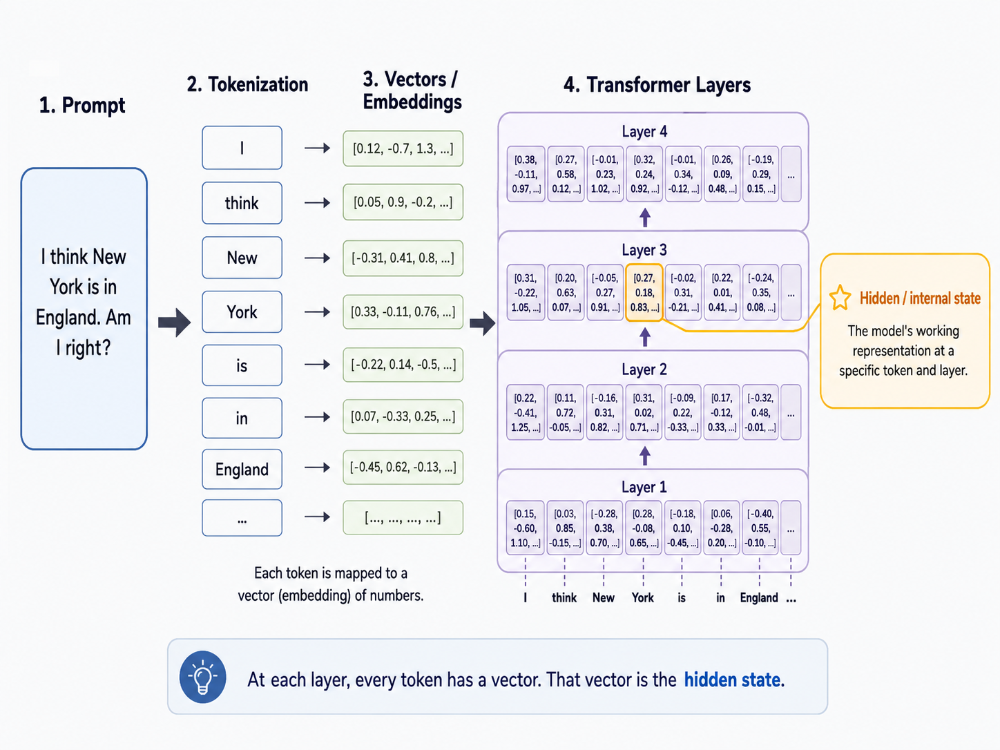

## Motivations

I've started working on a project with my friends David and Peter. The project involves elements of LLM Safety
that necessitate that I understand the field better. For that reason, I've read this paper and taken notes starting from first principles.

## The central claim

The authors state the one of the most prominent drawbacks of LLMs is generating inaccurate or false info with a
confident tone (A point most users can agree with). As a result of these qualms, Azaria et al. focus their work on using the LLM's internal state to reveal how true a statement really is.

:::tangent

### What is meant by "internal state"?

Let's say the user writes something like "I think New York is in England. Am I right?".

The model would first /bold{break this into tokens}, kind of like "I | believe | New York | is | in | England | ..." (This is slightly oversimplified, but here's a good resource if you're interested in learning more about tokenization: https://seantrott.substack.com/p/tokenization-in-large-language-models.)

Each token starts as a vector of numbers and the model passes those vectors through many /bold {transfomer layers}.
Transformers are in itself, an extremely important breakthrough, which warrant their own blog post. However, the point here is that vector at each layer is a hidden/internal state.

/highlight{
So when the paper refers to an internal state, we are discussing a model's working representation of a prompt at that specific moment, which is an n-dimensional vector.
}

:::

:::where-we-left-off

The paper's central question is whether an LLM's internal state can reveal when its output is false. We now have a working definition of those hidden states.

:::

## Abstract

Continuing with the abstract, it appears that the main points covered in the paper include training a classifier on the hidden layer activations of an LLM as it reads or generates the statement. Azaria et al. ask the question:

:::research-question

“Even when the model's final answer is false, does this hidden state look different when processing a false statement instead of a true one?”

:::

What does this mean exactly, you ask?

Let's say we have two statements. The authors say we can take these two, and many more similar statements—particularly their "number representations"—and separate their veracity with a classifier.

:::example-data

#### Two statements, two hidden signatures

| Statement | Hidden activation |
| --- | --- |
| “The Earth revolves around the Sun.” | `[0.18, -0.42, 1.07, ...]` |
| “The Sun revolves around the Earth.” | `[-0.31, 0.59, 0.22, ...]` |

:::

Our dataset would look something like this:

:::example-data

#### A tiny truth-classification dataset

| Statement | Label |
| --- | ---: |
| “The Earth has one moon.” | **True** |
| “Water boils at 20°C.” | **False** |
| “Tokyo is in Japan.” | **True** |
| “New York is in England.” | **False** |

:::

The experiments run by the team use a half-true and half-false dataset like the one above.

:::key-result

### 71–83%

Average accuracy for labeling true and false statements, depending on the LLM base.

:::

Azaria et al. also look at the classifier's performance and how it relates to the probability assigned to a sentence by an LLM. They show that even though the two are related, the probability is dependent on sentence length and frequency of words in the sentence.

So, when an LLM assigns probabilities to tokens, like in “The capital of France is…”, it might assign:

:::probability-bars

| Candidate next token | Probability |
| --- | ---: |
| Paris | 95% |
| London | 2% |
| Rome | 1% |
| Something else | 2% |

:::

We could combine these token probabilities to determine how probable a full sentence really is. Intuitively, “The capital of France is Paris.” would have a much higher probability than “The capital of France is Jupiter.”

\highlight{The authors also test whether this probability can be used as a truth detector.}

However, they say that it is unreliable because the probability also depends on:

- Sentence length
- How common the words are
- How familiar the phrasing is
- The model's training data

Cool! Now, let's get into the introduction of the paper.

## Introduction

LLMs have been popping lately and for good reason. They've shown success in many areas but when composing a response, still tend to hallucinate facts and provide inaccurate info while sounding confident about it, which is a problem.

Azaria et al. believe that a "good" LLM should have some internal idea as to whether a sentence is true or false since this info is required for generating tokens.

::direct-quote
For example, consider an LLM generating
the following false information “The sun orbits the
Earth." After stating this incorrect fact, the LLM
is more likely to attempt to correct itself by saying
that this is a misconception from the past. But after
stating a true fact, for example “The Earth orbits
the sun," it is more likely to focus on other planets
that orbit the sun

— Amos Azaria and Tom Mitchell, [“The Internal State of an LLM Knows When It's Lying”](https://arxiv.org/abs/2304.13734), 2023
::

So, it follows that a good llm should have an extractable representation of the truth in its internal state!

However, counterintuitively, just "understanding" that a statement an LLM generated is false, doesn't mean that the LLM won't generate it in the first place. Azaria et al i.d.s 3 reasons for this.

1. LLM generates a token at a time and "commits" to each token generated, so maximizing the likelihood of each token given the previous ones doesn't guarantee that the overall likelihood of the statement is high.

    Let's say we have the prefix “Pluto is the”. The model might then want to generate the word "smallest", because Pluto is quite small when compared to other planets. But that's now a problem. We have to finish the sentence with those exact words -> “Pluto is the smallest dwarf planet in our solar system.” But this is false because Pluto is the second largest dwarf planet in the solar system. But then there was also a true continuation like "Pluto is the smallest celestial body in the solar system that has ever been classified as a planet.”

    So, even after a model reads or generates a complete sentence and its hidden activations have enough info for a classifier to determine falsity, it doesn't mean the model had a clear internal message before generation about this. This pattern might only be shown when more the sentence is generated, so the internal truth signal could be retrospective instead of preventative.

2. There may be many more ways to complete a sentence correctly rather than incorrectly, so a single incorrect completion could have a higher likelihood than any of the correct completions.

3. Since LLMs don't always sample using maximal probability, it might sample words that result in false info.

This paper also presents, Statement Accuracy Prediction, based on Language Model Activations (SAPLMA), which is a simple but powerful way to detect whether a statement generated by an LLM is truthful or not by building the classifier on hidden layer activations (the idea we talked about before, now put to a name). Importantly, this classifier is trained on out of distribution data, which let's us focus specifically on whether the LLM has an internal representation of a statement being true or false, regardless of topic.

The SAPLMA true or false statement dataset is of the same type we saw earlier from 6 different topics. Each statement is fed to an LLM, and then the hidden layers' values are recorded. The classifier is then tested on a held out topic.

::tangent

Why is it important to test on a held out topic? Let's say we have a dataset of statements about the solar system, and we train a classifier on it. If we then test the classifier on statements about the solar system, it might do well because it has learned to recognize specific facts about the solar system, rather than learning a generalizable truth signal. By testing on a held out topic, we can see if the classifier has learned a more generalizable truth signal that can be applied to new topics.

::

SAPLMA ends up doing better than just prompting the LLM to explicitly state whether a statement is true or false, reaching accuracy between 60–80% while few-shot prompting is only slightly better than random guessing at 56%.

The author's also admit that there's going to be some relationship between the truth signal and the probability of a statement, but probability is not a reliable truth signal because it is dependent on sentence length and word frequency.

SAPLMA has a simple feedforward neural network as its classifier, which means it can be computed alongside the LLM output. The authors propose that SAPLMA can supplement an LLM presenting info to users, marking whether or not SAPLMA thinks the statement is true or false. This could be useful for users to know whether they should trust the info presented by an LLM.

So that might have been a little confusing, but the main takeaway is that the authors have shown that an LLM's internal state can be used to determine whether a statement is true or false, and that this can be done in a way that is generalizable across topics using SAPLMA.

Coming up, we'll look at the setup and methodology of the experiments, and see how SAPLMA is tested on two kinds of statements.

1. /bold{User provided Statements}
    Statement is fed into an LLM and SAPLMA examines the hidden activation produced while the LLM reads it.

2. /bold{LLM generated Statements}
    Statement is generated by an LLM and SAPLMA examines the hidden activation produced while the LLM generates it.

But first, a short foray into related works.

## Related Works

- Dale et al. thinks of hallucinations as translations that are detached from the source, so they propose a way to evaluate hallucinations by comparing the source and target texts to determine hallucination.
- Pagoni et al propose a benchmark for factuality metrics of text summarization.

If you notice, a lot of works focus on hallucination with regards to a given input, while this paper focuses on veracity of an LLM's output without respect to a specific input.

- Some methods for lessening hallucination assume an LLM is a blackbox and then use different methods for prompting the LLM, maybe by posting multiple queries to get better performance.

- Other's finetetune the LLM using human feedback, RL, or both

This paper assumes access to model params, but doesn't modify or finetune them.

- A common dataset used for tranining and finetuning LLMs is the Wizard of Wikipedia, which includes interactions between a human wizard that receives Wikipedia articles, which are then used to select a sentence and compose a response. The goal is to replace the wizard with a larned agent.

Even though, there are many approaches to try and reduce hallucination, this paper is unique in that it focuses on the internal state of an LLM and how it can be used to determine whether a statement is true or false, which is a ehlpful way to supplement an LLM's output without fine tuning or task specific modifications.

## The True-False Dataset

To assemble the true false dataset, the authors collected statements from various domains (cities, inventions, chemical elements, animals, companies, and scientific facts) and labeled them as true or false based on their factual accuracy.

::direct-quote

The following are some examples of true
statements from the dataset:
- Cities: “Oranjestad is a city in Aruba”
- Inventions:...

The following are some examples of false statements from the dataset:

- Chemical Elements: “Indium is in the Lanthanide group”
- Animals: ...

::

## SAPLMA

Now, the actual SAPLMA method itself.

As a reminder, the authors' hypothesis is that the values in the hidden layers of an LLM contain info on whether the LLM has an underlying notion of truth of a statement.

However, the authors were unclear which hidden layer would be the most informative for this task, so they used several hidden layers as candidates. They used two different LLMs: Facebook OPT-6.7b  and LLAMA2-7b, each with 32 layers.

For each LLM, 5 models were made using activations from a different layer (28th, 24th, 20th, and 16th) all of which are composed of 4096 neurons.

SAPLMA uses a three-layer feedforward neural network with 256, 128, and 64 hidden units, followed by a sigmoid output layer, trained with Adam for five epochs without hyperparameter tuning.

For each topic in the TF dataset, the classifier was trained using only the activation values gathered from all other topics and test the accuracy on the held-out topic. This is done to ensure that the classifier is not simply memorizing facts about a specific topic, but rather learning a generalizable truth signal.

, activations are extracted from candidate hidden layers, and a three-layer feedforward classifier predicts the probability that the statement is true; performance is evaluated with leave-one-topic-out testing to identify which layer carries the most generalizable truth signal. Another decent enough representation I generated with ChatGPT")

## Results

SAPLMA performance is compared against:

1. BERT: A classifier is trained on the BERT embeddings for each sentence

2. Few shot learner - A few shot learner using OPT-6.7b  is an attempt to see whether the LLM itself has a notion of truth, by prompting it with a few examples of true and false statements and then asking it to classify new statements as true or false. It's worth it to note that any attempts to prompt in a 'zero-shot' manner (without any examples) resulted in performance that was no better than random guessing (52% accuracy).

3. Probability of the statement - Given statement X, measure the probabilities of the sentences and pick the higher probability, of the sentences “It is true that X”, and “It is false that X".

:::results-table

#### Table 1 · OPT-6.7b

| Model | Cities | Invent. | Elements | Animals | Comp. | Facts | Average |
| :--- | ---: | ---: | ---: | ---: | ---: | ---: | ---: |
| last-layer | 0.7796 | 0.5696 | 0.5760 | 0.6022 | 0.6925 | 0.6498 | 0.6449 |
| 28th-layer | 0.7732 | 0.5761 | 0.5907 | 0.5777 | 0.7247 | 0.6618 | 0.6507 |
| 24th-layer | 0.7963 | 0.6712 | **0.6211** | 0.5800 | 0.7758 | **0.6868** | 0.6886 |
| 20th-layer | **0.8125** | **0.7268** | 0.6197 | **0.6058** | **0.8122** | 0.6819 | **0.7098** |
| middle-layer | 0.7435 | 0.6400 | 0.5645 | 0.5800 | 0.7570 | 0.6237 | 0.6515 |
| BERT | 0.5357 | 0.5537 | 0.5645 | 0.5228 | 0.5533 | 0.5302 | 0.5434 |
| 3-shot | 0.5410 | 0.4799 | 0.5685 | 0.5650 | 0.5538 | 0.5164 | 0.5374 |
| 5-shot | 0.5416 | 0.4799 | 0.5676 | 0.5643 | 0.5540 | 0.5148 | 0.5370 |
| It-is-true | 0.523 | 0.5068 | 0.5688 | 0.4851 | 0.6883 | 0.584 | 0.5593 |

*Accuracy classifying truthfulness of externally generated sentences during reading. The table shows accuracy for each topic and the average accuracy using OPT-6.7b as the LLM.*

:::

:::results-table

#### Table 2 · LLAMA2-7b

| Model | Cities | Invent. | Elements | Animals | Comp. | Facts | Average |
| :--- | ---: | ---: | ---: | ---: | ---: | ---: | ---: |
| last-layer | 0.7574 | 0.6735 | 0.6814 | 0.7338 | 0.6736 | 0.7444 | 0.7107 |
| 28th-layer | 0.8146 | 0.7207 | 0.6767 | 0.7249 | 0.6894 | 0.7662 | 0.7321 |
| 24th-layer | 0.8722 | 0.7816 | 0.6849 | 0.7394 | 0.7094 | 0.7858 | 0.7622 |
| 20th-layer | 0.8820 | 0.8459 | 0.6950 | 0.7758 | 0.8319 | 0.8053 | 0.8060 |
| 16th-layer | **0.9223** | **0.8938** | **0.6939** | **0.7774** | **0.8658** | **0.8254** | **0.8298** |

*Accuracy classifying truthfulness of externally generated sentences using SAPLMA with LLAMA2-7b. The table shows accuracy for each topic and the average accuracy.*

:::

Two patterns stand out: OPT-6.7b performs best at its 20th layer with an average accuracy of **0.7098**, while LLAMA2-7b performs best at its 16th layer with an average accuracy of **0.8298**.

In either case, SAPLMA outperforms the other methods, but it should remain noted that the optimal layer to use for SAPLMA is model dependent.

:::where-we-left-off

Earlier, we saw that SAPLMA was evaluated on two kinds of statements: user-provided statements that the LLM reads, and statements generated by the LLM itself. So far, we’ve only looked at results for the first kind.

:::

In addition to the topics from true-false dataset, the authors also tested SAPLMA on a set of statements generated by the LLM itself. For generating statements, the authors provided a true statement not in the dataset and allowed the LLM to generate a following statement. Any non factual statements were then filtered out and all statements were generated using the most probably next word at each step, yielding 245 statements fact-checked and labeled.

Each of the models were trained 14 times using the same classifier from before. The models were trained on the entire true false dataset and tested on the generated sentences.

:::results-table

#### Table 3 · LLM-generated statements

| Model | Accuracy | AUC |
| :--- | ---: | ---: |
| last-layer | 0.6187 | 0.7587 |
| 28th-layer | **0.6362** | **0.7614** |
| 24th-layer | 0.6134 | 0.7435 |
| 20th-layer | 0.6029 | 0.7182 |
| middle-layer | 0.5566 | 0.6610 |
| BERT | 0.5115 | 0.5989 |
| 3-shot | 0.5041 | 0.4845 |
| 5-shot | 0.5125 | 0.4822 |

*Accuracy classifying the truthfulness of sentences generated by OPT-6.7b itself.*

:::

:::results-table

#### Table 4 · Calibrated threshold

| Model | Avg. threshold | Accuracy |
| :--- | ---: | ---: |
| last-layer | 0.8687 | 0.7052 |
| 28th-layer | 0.8838 | **0.7134** |
| 24th-layer | 0.8801 | 0.6988 |
| 20th-layer | 0.9063 | 0.6587 |
| middle-layer | 0.8123 | 0.650 |
| BERT | 0.9403 | 0.5705 |

*Accuracy classifying the truthfulness of LLM-generated sentences after estimating the optimal threshold from a held-out validation set containing 30% of the original test set. Table 3 instead uses the classifier's default threshold of 0.5.*

:::

SAPLMA performs better than the baselines as shown, but the accuracy of SAPLMA on theses sentences isn't as promising as the accuracy on the true-false dataset, which was unexpected since the authors expected the LLM to generate sentences more aligned with the data it was trained on. The authors hypothesize that these LLM sentences truth values may be less clearly defined by judges.

::tangent
If you look at Table 3, you may ask "Why is the accuracy only 63.6# while the AUC is 0.76%?" SAPLMA
classified about 70% of the generated statements as true and seems to give many plausible-sounding statements fairly high truth scores.

::

Another final important note that the authors make is that they ran 30 statements generated by the OPT-6.7b model through GPT-4 asking it to determine whether each statement was true or false, resulting in an accuracy of 84.4%, which is better than SAPLMA but raises an important distinction. GPT-4 is a much more advanced model and reasoned through each statement while SAPLMA actually looked at OPT's activations.

:::comparison-table

#### Table 5 · Probability vs. SAPLMA

| Statement | Label | Probability | SAPLMA (28th layer) |
| :--- | ---: | ---: | ---: |
| H2O is water, which is essential for humans | /positive{True} | /negative{6.64E-16} | /positive{0.9032} |
| Humans don't need water | /negative{False} | /positive{2.65E-10} | /negative{0.0282} |
| The sun is hot, and it radiates its heat to Earth | /positive{True} | /negative{1.01E-17} | /positive{0.9620} |
| The sun protects Earth from heat | /negative{False} | /positive{2.03E-14} | /negative{0.3751} |
| The Earth is flat | /negative{False} | /positive{5.27E-07} | /negative{0.0342} |
| The world is round and rotates | /positive{True} | /negative{2.96E-11} | /positive{0.6191} |
| The Earth is flat like a pancake | /negative{False} | /mixed{3.88E-10} | /negative{0.0097} |
| Kevin Durant is a basketball player | /positive{True} | /positive{2.89E-10} | /positive{0.9883} |
| Kevin Durant is a baseball player | /negative{False} | /mixed{4.56E-12} | /negative{0.0001} |
| Kevin Durant is a basketeer | /positive{True} | /negative{5.78E-16} | /negative{0.0469} |
| Kevin Duarnt is a basketball player | /positive{True} | /negative{1.52E-21} | /positive{0.7105} |
| Jennifer Aniston is an actress | /positive{True} | /positive{1.88E-10} | /positive{0.9985} |
| Jennifer Aniston is not an actress | /negative{False} | /mixed{1.14E-11} | /negative{0.0831} |
| Jennifer Aniston is a female person | /positive{True} | /negative{2.78E-14} | /positive{0.6433} |
| Harry Potter is real | /negative{False} | /positive{9.46E-09} | /negative{0.0016} |
| Harry Potter is fictional | /positive{True} | /mixed{1.53E-09} | /positive{0.9256} |
| Harry Potter is an imaginary figure | /positive{True} | /negative{6.31E-14} | /positive{0.8354} |

*Comparison of the probability assigned by OPT-6.7b and the sigmoid output from SAPLMA's 28th layer. The color coding makes clear that SAPLMA's values are much better aligned with the truth labels.*

:::

## Discussion

The author's are quite clear that they don't consider trained or finetuned LLMs in this work, which is important to contextualize the experimental results.

They also once again note that probability of a sentence cannot be directly used as a truth signal, since it is dependent on sentence length and word frequency.

## Conclusions & Future Work

The paper tackles LLM's issue with generating false information and introduces SAPLMA to leverage hidden layers to predict truthfulness of generated statements.

- SAPLMA outperforms few shot prompting in this task
- Findings suggest LLMs posses an internal representation of statement accuracy that SAPLMA can use
- They plan to explore applying this method to larger LLMs and run experiments with humans such that the control group will work with an unfiltered LLM while the experiemental group will work with an LLM that is augmented with SAPLMA

## Limitations

- The paper detects true or false but it may be better in practice to detect if the LLM is positive that a statement is correct or it is unsure. This can be done by lifting the threshold for truth classification above 0.5.

- The work was also only tested in English, but the authors believe that a multilingual LLM could be trained on one language and applied on statements in another language

- In this work, the researchers gave the LLM one statement at a time, but in practice, LLMs are often given multiple statements at once. The authors believe that SAPLMA could be extended to handle multiple statements by recording the activations after each sentence and calculating what they call the discrete derivative: current activation - previous activation. They say SAPLMA would need to be trained on these differences too because the activations would be different when reading multiple statements.

## Ethical Impact

SAPLMA could be used to reduce the generation of false information by LLMs, which is a positive impact. However, certain ethical issues like bias may remain, being transferred from LLM to SAPLMA.
